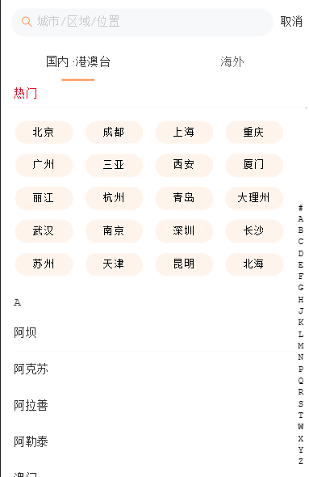
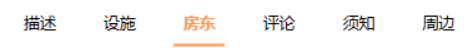
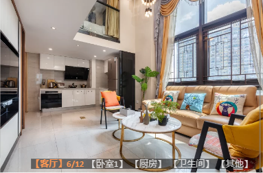
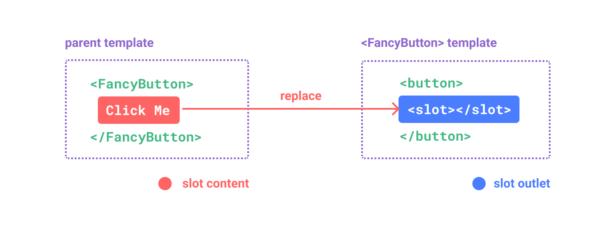

# 多个交互式动态索引栏（复杂数据）

### 1.city-location 大量的城市数据



> 请求网络数据，拿到`allCities`

- 主切换栏
  > 问题：不在同一个V-for模板，怎么样使交互联动=>下面的盒子根据上面盒子的点击切换渲染内容 => 实现动态Tab栏
  1. ==`M-model双向绑定`==
     
     利用数据是对象的特性，渲染内容根据`obj[key]`决定，渲染的`obj`是相同的，那么通过变换`key`就可以实现切换。
     1. 第一步：把上面盒子的数据双向绑定到JS变量里（还得找组件库里的`:name="key"`）
     2. 第二步：让下面盒子渲染的数据依赖双向绑定变量
     3. 最后：`TabsActive`会根据点击变化，那么`allcities[TabsActive]`也会变，就会重新渲染，实现切换。
     ```javascript
     const CurrentGroup = computed(() => {
         return allcities.value[TabsActive.value]?.cities
     })
     const HotCities = computed(() => {
         return allcities.value[TabsActive.value]?.hotCities
     })
     </script>
     
     <template>
         <div class="city">
             <div class="top">
                 <van-tabs v-model:active="TabsActive" :animated=true>
                     <template v-for="(value, key, index) in allcities">
                         <van-tab :title="value.title" :name="key"></van-tab>
                     </template>
                 </van-tabs>
             </div>
             <div class="content">
                     <Content :Group="CurrentGroup" :hotcity="HotCities" />
             </div>
         </div>
     </template>
     ```
     1. 但！由于数据太大，切换一次就重新渲染需要较长的时间，这样用户体验感不好。
        1. ==`优化`==：V-for都渲染出来，但只显示一个，用V-show控制：` v-show="key==TabsActive" `
        ```javascript
        <div class="content">
                    <!-- 网络延迟 -->
                    <template v-for="(value, key, index)  in allcities ">
                        <Content v-show="key==TabsActive" :Group="CurrentGroup" :hotcity="HotCities" />
                    </template>
                </div>
        ```
  2. 
- 侧索引栏
  
  
  > 描述：服务器返回的每个对象有如`‘A’`的属性，根据这个属性生成索引栏，匹配页面的滚动。
  > 
  > <br/>
  > 
  > 问题：UI库默认根据[A~Z]显示索引栏，但真实数据有些字母不存在如：`'I'`，`'V'`。
  1. ==`遍历Array.map()映射`==
     ```javascript
     const groupIndex = computed(() => {
         const list = props.Group.map(item => item.group)
         list.unshift('#')
         return list
     })
     ```
  2. 但！滚动的时候，滚动条是从页面顶部开始的，
     1. 修改滚动的元素
        1. 第一步确定滚动元素的高度：`height: calc(100vh - 98px);`
        2. 第二部设置 `overflow-y: auto;`
        3. 此部分涉及到了==<u>Z-index</u>==的知识点。
        ```javascript
        .content {
                height: calc(100vh - 98px);
                overflow-y: auto;
            }
        ```

<br/>

### 2.detail 顶部(滚动兼跳转功能)导航


- > 描述：能点击Tab-bar组件，滚动整个页面。还可以根据页面滚动的距离，反选tabbar组件里的元素。
  > 
  > ### **难点**：
  > 
  > - 布局定位的知识（[Z-index](https://developer.mozilla.org/zh-CN/docs/Web/CSS/z-index)、V-if&V-show()、 [V-if&V-show](https://www.nowcoder.com/search/question?query=V-if%E5%92%8CV-show&type=question&searchType=%E9%A1%B6%E9%83%A8%E5%AF%BC%E8%88%AA%E6%A0%8F)   ）
  > - 滚动`scroll`的知识（[Document：Scroll event](https://developer.mozilla.org/zh-CN/docs/Web/API/Document/scroll_event)  、[Element.scrollIntoView()](https://developer.mozilla.org/zh-CN/docs/Web/API/Element/scrollIntoView)  、[Element.scrollTo()](https://developer.mozilla.org/zh-CN/docs/Web/API/Element/scrollTo) 、 [Window.scrollTo()](https://developer.mozilla.org/zh-CN/docs/Web/API/Window/scrollTo) 、[HTMLElement.offsetTop](https://developer.mozilla.org/zh-CN/docs/Web/API/HTMLElement/offsetTop) 、[document.documentElement.scrollTop](https://developer.mozilla.org/zh-CN/docs/Web/API/Element/scrollTop) 、[document.documentElement.scrollHeight](https://developer.mozilla.org/zh-CN/docs/Web/API/Element/scrollHeight) 、 [document.documentElement.clientHeight](https://developer.mozilla.org/zh-CN/docs/Web/API/Element/clientHeight) 、 if（视口的长度+移动的距离==页面的总长度）{isReachBottom=true} ）
  > - 数据的敏感性（用什么数据渲染Tab-Bar以及如何与组件的位置关联：[name](https://cn.vuejs.org/api/options-misc.html#name)、getattribute()() 、[getAttribute(“name”)](https://developer.mozilla.org/zh-CN/docs/Web/API/Element/getAttribute) 、[:ref函数模板引用](https://cn.vuejs.org/guide/essentials/template-refs.html#function-refs)、）
  > - 数据的操作性（[ref父用子](https://cn.vuejs.org/guide/essentials/template-refs.html#ref-on-component)、 [Object.values()](https://developer.mozilla.org/zh-CN/docs/Web/JavaScript/Reference/Global_Objects/Object/values)、  [Array.map()](https://developer.mozilla.org/zh-CN/docs/Web/JavaScript/Reference/Global_Objects/Map)、 [Object.keys()](https://developer.mozilla.org/zh-CN/docs/Web/JavaScript/Reference/Global_Objects/Object/keys)、 ）
  > - 数据的算法（查找算法）
  > - 防抖（ 开关Switch思维 ）
  > - 健壮性（边缘测试）
  >   
  >   <br/>
  > 
  > #### 收获
  > 
  > - 可复用的监听页面滚动函数
  > - 组件的相关知识
  > - 数据操作的各种方法及思维
  > 
  > 👇
  1. **第一步：控制索引栏的显示**，这里涉及到使用`V-if`还是`V-show`的知识点，我自己考虑到这个索引栏不算很频繁的切换以及它不用在`template上`还有它本身是`fixed`定位不影响页面布局的情况，选择V-if。
     
      [涉及到响应式原理和Vue异步渲染的V-if知识点](https://www.nowcoder.com/questionTerminal/e5ecb569225e4b0c893275a49b3ad2a5) 、[一道题搞懂V-show和V-if的原理](https://www.nowcoder.com/search/question?query=V-if%E5%92%8CV-show&type=question&searchType=%E9%A1%B6%E9%83%A8%E5%AF%BC%E8%88%AA%E6%A0%8F) 、
  2. **第二步：获取各个组件实例并获得它们相对于页面的高度。**
     1. 通过在`template`中给元素添加`ref`属性就可以获取元素的实例，而不用原生`DOM`操作
        
        [组件上的ref--Vue官方文档](https://cn.vuejs.org/guide/essentials/template-refs.html#ref-on-component) 
        
        不过组件的ref实例还需要透过`.$el`去获取其根元素
        
        [$el--Vue官方文档](https://cn.vuejs.org/api/component-instance.html#el)
     2. 之后只需要ref实例.$el.offserTop即可获取元素的位置
  3. **第三步：点击索引栏，跳转到指定位置**
     1. 找到跳转函数：scrollTo() ，用法如下：
        ```javascript
        detailRef.value.scrollTo({
                top: sectionELs.value[key].offsetTop - 44,
                behavior: 'smooth'
            })
        ```
        
        MDN文档：[Element.scrollTo()](https://developer.mozilla.org/zh-CN/docs/Web/API/Element/scrollTo) 
     2. 
        
        我们需要一个数组存放那些组件实例，并且按钮索引栏对应的顺序存放，这样我们在点击事件中，通过栏里元素的index，就可以通过 数组[index].[offsetTop](https://developer.mozilla.org/zh-CN/docs/Web/API/HTMLElement/offsetTop) 获取位置，进行跳转
     3. 但是这样我们就把渲染索引栏的数组和存放组件实例的数组都写死了，这显然不符合编码思维。
        > 一定有啥办法可以更完美的实现...
        > 
        > ..
        > 
        > .
  4. **第四步，重新构建想法** 
     1. 为什么不把Tab-Bar用对象渲染呢，key放各个组件的名字，value放各个组件的实例。这样不就把各个组件的offsetTop与索引栏的元素对应起来了吗
     2. 两个要点：
        1. 如何动态存储组件的实例？ 
        2. 如何将各个组件的名字给索引栏？
     3. 这意味着我们需要对组件进行复杂的逻辑处理：那么就要动用函数的力量了。
        
        [:ref的函数引用--Vue官方文档](https://cn.vuejs.org/guide/essentials/template-refs.html#function-refs) =>没错，就是有函数而且该函数会收到元素引用作为其第一个参数，与刚才不同，函数模板引用需要使用动态的`:ref`绑定。*（这么做需要注意，这个函数除了会在每次更新的时候调用，在绑定的元素or组件被卸载时也会调用一次，此时组件实例为null）*
        
        [getAttribute()--MDN文档](https://developer.mozilla.org/zh-CN/docs/Web/API/Element/getAttribute) =>两者配合，天下我有
     4. 先给每个组件写上`name属性`然后在`ref引用函数`里get每个组件实例`attribute('name')`作为key，实例本身作为value，一个完美的对象就诞生了。
  5. **第五步，小功告成，正式开始**，重回第三步：（点击索引栏，跳转到指定位置）
     1. 将对象传给索引栏，索引栏通过V-for对象，key值就是组件的名字，将index作为点击事件的参数传递给父组件，这里是[emit子传父知识点](https://cn.vuejs.org/api/component-instance.html#emit)：子组件代码（Vue2）如下👇
        ```javascript
        <script >
        export default {
            props: {
                titles: {
                    type: Array,
                    default: () => []
                }
            },
            data() {
                return {
                    currentIndex: 0
                }
            },
            emits: ['tabItemClick'],
            methods: {
                itemClick(index) {
                    this.currentIndex = index
                    this.$emit('tabItemClick', index)
                },
                setCurrentIndex(index) {
                    this.currentIndex = index
                }
            }
        }
        </script>
        
        <template>
            <div class="indexTabBar">
                <template v-for="(item, index) in titles" :key="index">
                    <div class="item" :class="{ actiie: index == currentIndex }" @click="itemClick(index)">
                        <span>{{ item }}</span>
                    </div>
                </template>
            </div>
        </template>
        ```
     2. 在父组件传入callback进子组件，根据index无法直接获取我们存储组件实例对象的value，故先用[Object.keys()](https://developer.mozilla.org/zh-CN/docs/Web/JavaScript/Reference/Global_Objects/Object/keys)获取全部的key，再用index去匹配到key的值，然后再用key去访问value。
        
        一个[scrollTo()](https://developer.mozilla.org/zh-CN/docs/Web/API/Element/scroll)搞定第三步。
  6. **第六步，改变索引栏被选中的元素**
     
     修改子组件的值，[父传子，ref引用](https://cn.vuejs.org/guide/essentials/template-refs.html#function-refs) 在实例是`options-API`的情况，那么实例里就是子组件的this
     > 被引用的组件实例和该子组件的 this 完全一致，这意味着**<u>父组件对子组件的每一个属性和方法都有完全的访问权</u>**。这使得在父组件和子组件之间创建紧密耦合的实现细节变得很容易——Vue官方文档
     1. 神奇的来了
        ```javascript
        Ref_IndexTabBar.value.currentIndex = currentindex
        ```
        
        在父组件里直接改变子组件的值
     2. 稍等！父组件的`currentindex`哪来的？
        
        我们既然要实时根据滚动的距离修改`currentindex`，那当然要用[watch](https://cn.vuejs.org/api/reactivity-core.html#watch)啦。
        
        涉及到算法👇
        1. 每次滚动，都进行一次数组查找，查找：数组中**第一个**大于目标数字的数字
           
           用到了`for`+`if`+`break`的组合
           ```javascript
           for (let index = 0; index < cpnsTop.length; index++) {
                   const element = cpnsTop[index];
                   if (element > newValue) {
                       currentindex = index
                       break
                   }
               }
           ```
           
           返回查找到的那个元素的index
- > 完美！*★,°*:.☆(￣▽￣)/$:*.°★* 。❀❀--<-<-<🌹🌹🌹

<br/>

### 3.Swipe-indicator



- 轮播图的索引栏
  > 描述：房屋图片的展示，数量有几十张，因此数据会细分为不同的类别，比如客厅、卧室...。索引栏不按照几十张从头到尾滚动而是在每一个类别滚动。 
  > 
  > ### **难点**

> 1. 算是个较复杂的数据结构（不是单纯的渲染一个数组or对象，是数据之间有多个变量联系，并且还有嵌套关系）
> 2. 根据`已有数据` 构建出=>`符合需求的新数据`。
> 3. 同时利用已有数据和再生数据 设计出适合的结构建立起联系，相互配合渲染。
> 4. 熟练运用数组和对象方法、组件库。
>    
>    <br/>
> 
> **解决**：Vant组件库（==`具名作用域插槽`== (👇下面有专门篇章) ）、构建新对象（[for ··· of](https://developer.mozilla.org/zh-CN/docs/Web/JavaScript/Reference/Statements/for...of)）、关联数据（[findIndex](https://developer.mozilla.org/zh-CN/docs/Web/JavaScript/Reference/Global_Objects/Array/findIndex)）、处理数据（[replace](https://developer.mozilla.org/zh-CN/docs/Web/JavaScript/Reference/Global_Objects/String/replace)）
> 
> **收获**：对复杂数据的处理能力

- xxxx
yyyyyyy
- 

<br/>

<br/>

<br/>

# 路由的使用场景

> 1. 点击事件`@click` ==跳转==到子页面 `router.push('path')`

> 2. 点击事件`@click` ==回退==到上一页面 `router.back()`

<br/>

- [ ] 路由器👈是router  ~~  route是👉路由/路径

<br/>

> 3. [<router-view>](https://router.vuejs.org/zh/guide/index.html#router-view)：可放在任何地方，显示与 url 对应的组件。

> 4. [meta](https://router.vuejs.org/zh/guide/advanced/meta.html) ：可将任意信息附加到路由上，如
>    - **限制条件**（当前路径不显示底部Tab-Bar）
>    - **鉴权**（配合[redirect重定向](https://router.vuejs.org/zh/api/index.html#redirect-1)：没登录的时候乱点，就会跳到登录界面）

> 5. [route.params对象](https://router.vuejs.org/zh/api/#params) ：跳转到带参数的页面时，params对象就是参数字典
>    - **网络请求** （任何二级页面都可以在`path`加上网络请求需要的参数）
>    - ```javascript
>      // fantastic.vue
>      function detail(data) {
>          console.log(data.houseId)
>          router.push('/detail/' + data.houseId)
>      }
>      // detail.vue(二级页面)
>      import { useRoute } from 'vue-router';
>      const route = useRoute()
>      const detailData = ref()
>      getDetail(route.params.id).then((res) => {
>          detailData.value = res.data
>      })
>      // service/moduels/detail.js
>      import HYRequest from '../request'
>      export function getDetail(houseId) {
>          return HYRequest.get({
>              url: '/detail/infos',
>              params: {
>                  houseId
>              }
>          })
>      }
>      ```
> 6. query：...待记录😮

# 状态管理的使用场景

> 1. ==跨页面==使用全局变量（记录用户的核心选择，时间地点等）
>    - 酒店民宿的 =>城市如 “福建”、时间如“2022-02-08”
>    - 记账的 =>账本如 “家庭账本”

> 2. ==网络请求中间站==

> 3. ==加载画面== `isLoading`（所有需要网络请求页面，开始改为true，结束改false）

> 4. ==分页== `currentPage`（因为网络请求和数据保存都在Store里，分页也只能在这控制）
>    - 记得第二页开始用`Array.push`

# Computed的使用场景

> 1. 简化`template`中的代码量，==提高代码的可读性及可维护性==
> 
> ```javascript
> // template
> <Content v-show="key==TabsActive" :Group="CurrentGroup" :hotcity="HotCities" />
> // script
> const CurrentGroup = computed(() => {
>     return allcities.value[TabsActive.value]?.cities
> })
> const HotCities = computed(() => {
>     return allcities.value[TabsActive.value]?.hotCities
> })
> ```

<br/>

# 父子间通信

### 1.props

> 应用场景

1. 父组件统一管理数据，分别传递给子组件

***

### 2.emit

> 应用场景

1. 子组件使父组件变化

***

### 3.ref组件实例

> 应用场景

1. 父拿子私有的东西(变量、方法)

***

### 4.Router

> 应用场景 

- 去看绕特(曼)

***

### 5.Store

> 应用场景

1. 就是共享全局变量罢了

***

# 6.Slot 插槽

- 概念
  - 从外向内（父 => 子组件）传递一些模板片段，让子组件在内部渲染这些片段。
- 原理
  - calllback fn
- 功能
  - 使组件更加灵活和具有可复用性
  - 一个组件可以用在不同的地方去渲染不同的内容，但同时还保证整个组件的样式风格统一。
- ### 使用
  - 
  - 默认内容：`<slot>`我是默认内容`</slot>`
  - ==具名插槽==
- 
- attribute `name` --👈子 || 父👉--`v-slot:name`==`#name` 
- 动态插槽名
  -
  ```
  ```javascript
  <base-layout>
    <template v-slot:[dynamicSlotName]>
      ...
    </template>
  
    <!-- 缩写为 -->
    <template #[dynamicSlotName]>
      ...
    </template>
  </base-layout>
  ```
  
    ```
  - [作用域插槽](https://cn.vuejs.org/guide/components/slots.html#scoped-slots) 
    - 
    - 解决了什么问题？
      1. 插槽的内容可能想要同时使用父组件域内和子组件域内的数据。
         
         也就是==子传父==
    - 原理
      - 跟`props`一样
    - [具名作用域插槽](https://cn.vuejs.org/guide/components/slots.html#scoped-slots) 
      -  
      - x
    - y
  - z
  - m
- n

<br/>

# 项目优化

- 首屏速度
- 
  ```
  1.  
  2. 
  ```
- 
- 
- 
- 
- 
