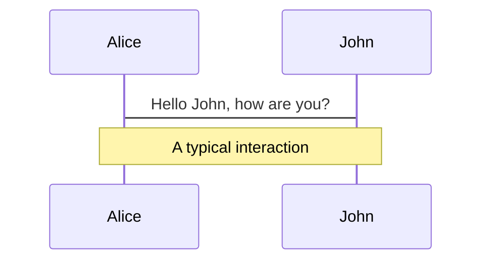
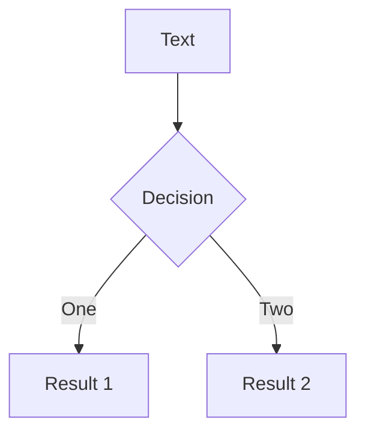
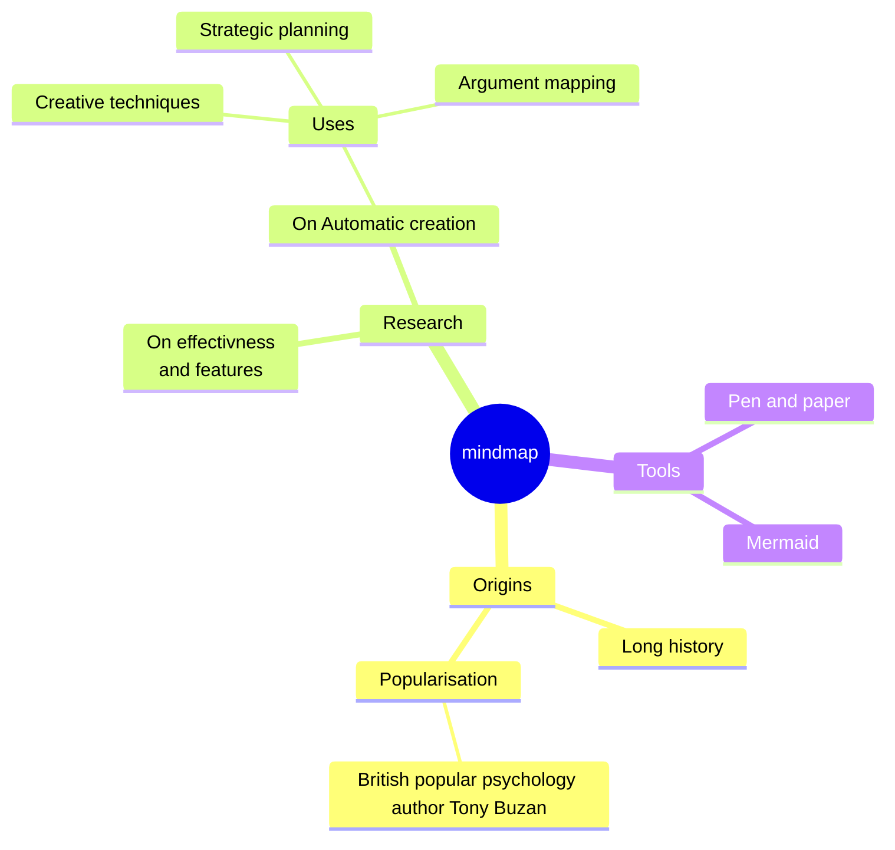
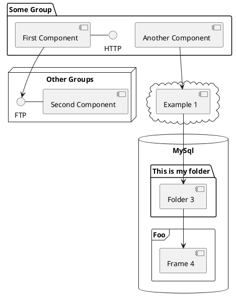

# `位`运算

世界上只有10种人，懂二进制的和不懂二进制的。

<div class="pt-12">
  <span @click="$slidev.nav.next" class="px-2 py-1 rounded cursor-pointer" hover="bg-white bg-opacity-10">
    Press Space for next page <carbon:arrow-right class="inline"/>
  </span>
</div>

<div class="abs-br m-6 flex gap-2">
  <button @click="$slidev.nav.openInEditor()" title="Open in Editor" class="text-xl slidev-icon-btn opacity-50 !border-none !hover:text-white">
    <carbon:edit />
  </button>
  <a href="https://github.com/slidevjs/slidev" target="_blank" alt="GitHub" title="Open in GitHub"
    class="text-xl slidev-icon-btn opacity-50 !border-none !hover:text-white">
    <carbon-logo-github />
  </a>
</div>

<!--
The last comment block of each slide will be treated as slide notes. It will be visible and editable in Presenter Mode along with the slide. [Read more in the docs](https://sli.dev/guide/syntax.html#notes)
-->

---
transition: fade-out
---

# 什么是位运算?

程序中的数在计算机内存中都是以二进制的形式存在的，位运算就是直接对整数在内存中对应的二进制位进行操作。

- 📝 **二进制原码、补码、反码、移码** - focus on the content with Markdown, and then style them later
- 🎨 **补码** - theme can be shared and used with npm packages
- 🧑‍💻 **运算符** - code highlighting, live coding with autocompletion
- 🤹 **位运算的应用** - embedding Vue components to enhance your expressions
- 🎥 **Recording** - built-in recording and camera view
- 📤 **Portable** - export into PDF, PNGs, or even a hostable SPA
- 🛠 **Hackable** - anything possible on a webpage

<br>
<br>

Read more about [Why Slidev?](https://sli.dev/guide/why)

<!--
You can have `style` tag in markdown to override the style for the current page.
Learn more: https://sli.dev/guide/syntax#embedded-styles
-->

<style>
h1 {
  background-color: #2B90B6;
  background-image: linear-gradient(45deg, #4EC5D4 10%, #146b8c 20%);
  background-size: 100%;
  -webkit-background-clip: text;
  -moz-background-clip: text;
  -webkit-text-fill-color: transparent;
  -moz-text-fill-color: transparent;
}
</style>

<!--
Here is another comment.
-->

---
layout: default
---

# Table of contents

```html
<Toc minDepth="1" maxDepth="1"></Toc>
```

<Toc maxDepth="1"></Toc>

---
transition: slide-up
level: 2
---

# Navigation

Hover on the bottom-left corner to see the navigation's controls panel, [learn more](https://sli.dev/guide/navigation.html)

## Keyboard Shortcuts

|     |     |
| --- | --- |
| <kbd>right</kbd> / <kbd>space</kbd>| next animation or slide |
| <kbd>left</kbd>  / <kbd>shift</kbd><kbd>space</kbd> | previous animation or slide |
| <kbd>up</kbd> | previous slide |
| <kbd>down</kbd> | next slide |

<!-- https://sli.dev/guide/animations.html#click-animations -->

<p v-after class="absolute bottom-23 left-45 opacity-30 transform -rotate-10">Here!</p>

---


# 位运算

0与1的艺术

<div grid="~ cols-4 gap-2" m="-t-2">
  
```markdown
# 与（AND）
1010 (十进制 10)
& 1100 (十进制 12)
---------
1000 (十进制 8)
```

```markdown
# 或（OR）
1010 (十进制 10)
| 1100 (十进制 12)
---------
1110 (十进制 14)
```

```markdown
# 异或（XOR）
1010 (十进制 10)
^ 1100 (十进制 12)
---------
0110 (十进制 6)
```
  
```markdown
# 取反（NOT）
~1010 (十进制 10)
---------
0101 (十进制 -11，
      因为取反后要加一)
```

</div>

<div grid="~ cols-4 gap-2" m="-t-2">
  
```markdown
## 与运算（AND）： 
  将两个二进制数的对应位进行
  逻辑与操作，只有当两个位都
  是1时，结果才是1。用符号
  "&" 表示。
```

```markdown
## 或运算（OR）： 
  将两个二进制数的对应位进行
  逻辑或操作，只要两个位中有
  一个是1，结果就是1。用符号
  "|" 表示。
```

```markdown
## 异或运算（XOR）： 
  将两个二进制数的对应位进行
  逻辑异或操作，如果两个位不
  相同，则结果是1；如果相同，
  则结果是0。用符号 "^" 表示。
```
  
```markdown
## 取反运算（NOT）： 
  对一个二进制数的每一位取反，
  即0变成1，1变成0。
  用符号 "~" 表示。
  -
```

</div>

<br>


```python
# Python 的位运算操作符，用于对整数的二进制表示进行操作。

result = 0b1010 & 0b1100  # 十进制结果为 8
result = 0b1010 | 0b1100  # 十进制结果为 14
result = 0b1010 ^ 0b1100  # 十进制结果为 6
result = ~0b1010  # 十进制结果为 -11
```

<!--
Presenter note with **bold**, *italic*, and ~~striked~~ text.

Also, HTML elements are valid:
<div class="flex w-full">
  <span style="flex-grow: 1;">Left content</span>
  <span>Right content</span>
</div>
-->

---
preload: false
---

# 位运算

0与1的艺术

<div grid="~ cols-2 gap-2" m="-t-2">
  
```markdown
# 左移
1010 (十进制 10) 左移 2 位
---------
101000 (十进制 40)
```

```markdown
# 右移
1010 (十进制 10) 右移 2 位
---------
10 (十进制 2)
```

</div>

<div grid="~ cols-2 gap-2" m="-t-2">
  
```markdown
## 左移运算：  
  将一个二进制数的所有位向左移动指定的位数，
  右侧空出的位用0填充。用符号 "<<" 表示。
```

```markdown
## 右移运算： 
  将一个二进制数的所有位向右移动指定的位数，
  左侧空出的位根据符号位或补零。用符号 ">>" 表示。
```

</div>

<br>


```python
# Python 的位运算操作符，用于对整数的二进制表示进行操作。

result = 0b1010 << 2  # 十进制结果为 40
result = 0b1010 >> 2  # 十进制结果为 2
```


---
class: px-20
---

# 应用

它们在计算机科学和嵌入式系统等领域经常被使用。位运算可以用于提高性能、压缩数据、实现状态机等。在实际应用中，位运算的威力常常体现在对性能和资源的高效利用。

<div grid="~ cols-2 gap-2" m="-t-2">

```yaml
---
theme: default
---
```

```yaml
---
theme: seriph
---
```


</div>

这些运算符允许你在Python中执行位级别的操作，通常在需要直接处理二进制数据或进行底层位操作时非常有用。在使用位运算时，请确保了解所处理数据的二进制表示，以便正确执行操作。


---
layout: image-right
image: https://source.unsplash.com/collection/94734566/1920x1080
---

# 交换两个变量的值

问题：了解位运算的基础操作，如与、或、异或、取反、左移和右移。使用这些操作完成一些简单的任务，比如交换两个变量的值。

解答：
```python {none|all}
# 交换两个变量的值
a = 5
b = 10

a = a ^ b
b = a ^ b
a = a ^ b

print("a =", a)
print("b =", b)
```

<arrow v-click="[3, 4]" x1="400" y1="420" x2="230" y2="330" color="#564" width="3" arrowSize="1" />


<style>
.footnotes-sep {
  @apply mt-20 opacity-10;
}
.footnotes {
  @apply text-sm opacity-75;
}
.footnote-backref {
  display: none;
}
</style>

<!--
a:  10 ————> 11 ————> 01

b:  01 ————> 10
-->

---
layout: image-right
image: https://source.unsplash.com/collection/94734566/1920x1080
---

# 检查整数的奇偶性

问题：使用位运算判断一个整数是奇数还是偶数。

解答：
```python {none|all}
def is_even(num):
    return (num & 1) == 0

print(is_even(4))  # True
print(is_even(7))  # False
```


---
layout: image-right
image: https://source.unsplash.com/collection/94734566/1920x1080
---

# 统计二进制中的1的个数
问题： 实现一个函数，输入一个无符号整数，返回其二进制表示中的1的个数。

解答：

```python {none|all}
def count_ones(num):
    count = 0
    while num:
        count += num & 1
        num >>= 1
    return count

print(count_ones(9))  # 2

```


---
layout: image-right
image: https://source.unsplash.com/collection/94734566/1920x1080
---

# 判断一个数是否是2的幂
问题： 给定一个整数，判断它是否是2的幂。

解答：
```python {none|all}
def is_power_of_two(num):
    return num > 0 and (num & (num - 1)) == 0

print(is_power_of_two(16))  # True
print(is_power_of_two(18))  # False


```


---
layout: image-right
image: https://source.unsplash.com/collection/94734566/1920x1080
---

# 找出缺失的数字
问题： 给定一个包含 n 个不同数字的数组，其中数字取自 0, 1, 2, ..., n，找出缺失的数字。

解答：


```python
def missing_number(nums):
    n = len(nums)
    result = n
    for i in range(n):
        result ^= i ^ nums[i]
    return result

print(missing_number([3, 0, 1]))  # 2

```
<br/>

> 这次我们使用了异或运算（XOR）。异或运算有一个重要的性质，即对同一个值进行两次异或操作会得到原始的值。在这个问题中，我们对 0 到 n 进行异或，然后再对数组中的每个元素进行异或，最终的结果就是缺失的数字。

[Learn more](https://cscircles.cemc.uwaterloo.ca/visualize#code=def+missing_number(nums)%3A%0A++++n+%3D+len(nums)%0A++++result+%3D+n%0A++++for+i+in+range(n)%3A%0A++++++++result+%5E%3D+i+%5E+nums%5Bi%5D%0A++++return+result%0A%0Aprint(missing_number(%5B3,+0,+1,+5,+4%5D))++%23+2&mode=display&raw_input=&curInstr=0)


---
layout: image-right
image: https://source.unsplash.com/collection/94734566/1920x1080
---

# 只出现一次的数字
问题： 给定一个非空数组，其中每个元素出现两次，除了一个元素只出现一次。找出那个只出现一次的元素。

解答：
```python
def single_number(nums):
    result = 0
    for num in nums:
        result ^= num
    return result

print(single_number([4, 3, 2, 4, 3]))  # 2


```
<br/>

> 这个问题中，我们利用异或运算的性质，对数组中的所有元素进行异或操作，最终得到的结果就是只出现一次的数字。

[Learn more](https://cscircles.cemc.uwaterloo.ca/visualize#code=def+single_number(nums)%3A%0A++++result+%3D+0%0A++++for+num+in+nums%3A%0A++++++++result+%5E%3D+num%0A++++return+result%0A%0Aprint(single_number(%5B4,+3,+2,+4,+3%5D))++%23+2&mode=display&raw_input=&curInstr=0)


---
layout: image-right
image: https://source.unsplash.com/collection/94734566/1920x1080
---

# 两个只出现一次的数字
问题： 给定一个非空数组，其中每个元素都出现两次，除了两个元素只出现一次。找出这两个只出现一次的元素。

```python {none|all}
def two_single_numbers(nums):
    xor_result = 0
    for num in nums:
        xor_result ^= num
        
    # 找到两个只出现一次的数字在二进制表示中的不同位
    diff_bit = 1
    while (diff_bit & xor_result) == 0:
        diff_bit <<= 1
    # 根据不同位将数组分为两组，分别对每组进行异或
    group1, group2 = 0, 0
    for num in nums:
        if (num & diff_bit) == 0:
            group1 ^= num
        else:
            group2 ^= num

    return [group1, group2]

print(two_single_numbers([4, 2, 3, 3, 2, 7])) 
#[4, 7]

```

<!--
首先，对数组中的所有元素进行异或操作，得到的结果就是两个只出现一次的数字的异或结果。
    然后，我们找到这个异或结果中的某一位，以此将数组分为两组，每一组分别包含一个只出现一次的数字。
    最后，对每一组进行异或操作，得到两个只出现一次的数字。

在第七题中，我们使用异或运算的一个性质来找到两个只出现一次的数字在二进制表示中的不同位。该性质是：

	异或运算满足交换律和结合律，而且对于任何数 x 异或自身的结果为 0。

具体来说，在我们的问题中，如果我们对数组中所有的元素进行异或操作，最终得到的结果就是两个只出现一次的数字的异或结果。

    xor_result = 0
    for num in nums:
        xor_result ^= num
现在，xor_result 中的二进制表示中的每一位，要么是两个只出现一次的数字在该位上相同（为0），要么是不同（为1）。我们需要找到这两个数字在这一位上的差异。

我们可以使用一个变量 diff_bit，初始值设为1。然后，通过一个循环左移这个位，直到 diff_bit 在 xor_result 中的对应位上为1。这样，diff_bit 就找到了两个只出现一次的数字在这一位上的不同位。

    diff_bit = 1
    while (diff_bit & xor_result) == 0:
        diff_bit <<= 1
        
        
举例说明：

假设两个只出现一次的数字分别是 a = 6（二进制表示为 0110）和 b = 2（二进制表示为 0010）。我们对数组中的所有元素进行异或操作：

    xor_result = 6 ^ 2 ^ 4 ^ 3 ^ 3 ^ 2 ^ 9 ^ 7
结果 xor_result 的二进制表示为 1101。我们找到了 diff_bit，它的二进制表示为 0010。

然后，我们可以使用 diff_bit 将数组分为两组，一组中包含该位为0的数字，另一组中包含该位为1的数字。再分别对每组进行异或操作，就可以得到两个只出现一次的数字。

[Learn more](https://cscircles.cemc.uwaterloo.ca/visualize#code=def+two_single_numbers(nums)%3A%0A++++xor_result+%3D+0%0A++++for+num+in+nums%3A%0A++++++++xor_result+%5E%3D+num%0A++++++++%0A++++%23+%E6%89%BE%E5%88%B0%E4%B8%A4%E4%B8%AA%E5%8F%AA%E5%87%BA%E7%8E%B0%E4%B8%80%E6%AC%A1%E7%9A%84%E6%95%B0%E5%AD%97%E5%9C%A8%E4%BA%8C%E8%BF%9B%E5%88%B6%E8%A1%A8%E7%A4%BA%E4%B8%AD%E7%9A%84%E4%B8%8D%E5%90%8C%E4%BD%8D%0A++++diff_bit+%3D+1%0A++++while+(diff_bit+%26+xor_result)+%3D%3D+0%3A%0A++++++++diff_bit+%3C%3C%3D+1%0A++++%23+%E6%A0%B9%E6%8D%AE%E4%B8%8D%E5%90%8C%E4%BD%8D%E5%B0%86%E6%95%B0%E7%BB%84%E5%88%86%E4%B8%BA%E4%B8%A4%E7%BB%84%EF%BC%8C%E5%88%86%E5%88%AB%E5%AF%B9%E6%AF%8F%E7%BB%84%E8%BF%9B%E8%A1%8C%E5%BC%82%E6%88%96%0A++++group1,+group2+%3D+0,+0%0A++++for+num+in+nums%3A%0A++++++++if+(num+%26+diff_bit)+%3D%3D+0%3A%0A++++++++++++group1+%5E%3D+num%0A++++++++else%3A%0A++++++++++++group2+%5E%3D+num%0A%0A++++return+%5Bgroup1,+group2%5D%0A%0Aprint(two_single_numbers(%5B4,+2,+3,+3,+2,+7%5D))++%23+%5B4,+7%5D&mode=display&raw_input=&curInstr=40)

- Step 22
-
-->

---
layout: image-right
image: https://source.unsplash.com/collection/94734566/1920x1080
---

# 找出缺失的数字
问题： 给定一个包含 n 个不同数字的数组，其中数字取自 0, 1, 2, ..., n，找出缺失的数字。

解答：


```python
def missing_number(nums):
    n = len(nums)
    result = n
    for i in range(n):
        result ^= i ^ nums[i]
    return result

print(missing_number([3, 0, 1]))  # 2

```
<br/>

> 这次我们使用了异或运算（XOR）。异或运算有一个重要的性质，即对同一个值进行两次异或操作会得到原始的值。在这个问题中，我们对 0 到 n 进行异或，然后再对数组中的每个元素进行异或，最终的结果就是缺失的数字。

[Learn more](https://cscircles.cemc.uwaterloo.ca/visualize#code=def+missing_number(nums)%3A%0A++++n+%3D+len(nums)%0A++++result+%3D+n%0A++++for+i+in+range(n)%3A%0A++++++++result+%5E%3D+i+%5E+nums%5Bi%5D%0A++++return+result%0A%0Aprint(missing_number(%5B3,+0,+1,+5,+4%5D))++%23+2&mode=display&raw_input=&curInstr=0)


---
layout: image-right
image: https://source.unsplash.com/collection/94734566/1920x1080
---

# 找出缺失的数字
问题： 给定一个包含 n 个不同数字的数组，其中数字取自 0, 1, 2, ..., n，找出缺失的数字。

解答：


```python
def missing_number(nums):
    n = len(nums)
    result = n
    for i in range(n):
        result ^= i ^ nums[i]
    return result

print(missing_number([3, 0, 1]))  # 2

```
<br/>

> 这次我们使用了异或运算（XOR）。异或运算有一个重要的性质，即对同一个值进行两次异或操作会得到原始的值。在这个问题中，我们对 0 到 n 进行异或，然后再对数组中的每个元素进行异或，最终的结果就是缺失的数字。

[Learn more](https://cscircles.cemc.uwaterloo.ca/visualize#code=def+missing_number(nums)%3A%0A++++n+%3D+len(nums)%0A++++result+%3D+n%0A++++for+i+in+range(n)%3A%0A++++++++result+%5E%3D+i+%5E+nums%5Bi%5D%0A++++return+result%0A%0Aprint(missing_number(%5B3,+0,+1,+5,+4%5D))++%23+2&mode=display&raw_input=&curInstr=0)


---
layout: image-right
image: https://source.unsplash.com/collection/94734566/1920x1080
---

# 找出缺失的数字
问题： 给定一个包含 n 个不同数字的数组，其中数字取自 0, 1, 2, ..., n，找出缺失的数字。

解答：


```python
def missing_number(nums):
    n = len(nums)
    result = n
    for i in range(n):
        result ^= i ^ nums[i]
    return result

print(missing_number([3, 0, 1]))  # 2

```
<br/>

> 这次我们使用了异或运算（XOR）。异或运算有一个重要的性质，即对同一个值进行两次异或操作会得到原始的值。在这个问题中，我们对 0 到 n 进行异或，然后再对数组中的每个元素进行异或，最终的结果就是缺失的数字。

[Learn more](https://cscircles.cemc.uwaterloo.ca/visualize#code=def+missing_number(nums)%3A%0A++++n+%3D+len(nums)%0A++++result+%3D+n%0A++++for+i+in+range(n)%3A%0A++++++++result+%5E%3D+i+%5E+nums%5Bi%5D%0A++++return+result%0A%0Aprint(missing_number(%5B3,+0,+1,+5,+4%5D))++%23+2&mode=display&raw_input=&curInstr=0)


---
layout: image-right
image: https://source.unsplash.com/collection/94734566/1920x1080
---

# 找出缺失的数字
问题： 给定一个包含 n 个不同数字的数组，其中数字取自 0, 1, 2, ..., n，找出缺失的数字。

解答：


```python
def missing_number(nums):
    n = len(nums)
    result = n
    for i in range(n):
        result ^= i ^ nums[i]
    return result

print(missing_number([3, 0, 1]))  # 2

```
<br/>

> 这次我们使用了异或运算（XOR）。异或运算有一个重要的性质，即对同一个值进行两次异或操作会得到原始的值。在这个问题中，我们对 0 到 n 进行异或，然后再对数组中的每个元素进行异或，最终的结果就是缺失的数字。

[Learn more](https://cscircles.cemc.uwaterloo.ca/visualize#code=def+missing_number(nums)%3A%0A++++n+%3D+len(nums)%0A++++result+%3D+n%0A++++for+i+in+range(n)%3A%0A++++++++result+%5E%3D+i+%5E+nums%5Bi%5D%0A++++return+result%0A%0Aprint(missing_number(%5B3,+0,+1,+5,+4%5D))++%23+2&mode=display&raw_input=&curInstr=0)


---

# Diagrams

You can create diagrams / graphs from textual descriptions, directly in your Markdown.

<div class="grid grid-cols-4 gap-5 pt-4 -mb-6">









</div>

[Learn More](https://sli.dev/guide/syntax.html#diagrams)

---
src: ./pages/multiple-entries.md
hide: false
---

---
layout: center
class: text-center
---

# Learn More

[Documentations](https://sli.dev) · [GitHub](https://github.com/slidevjs/slidev) · [Showcases](https://sli.dev/showcases.html)
